

    

## Overview
In today’s increasingly remote work environment, many individuals find themselves grappling with feelings of isolation and disconnection from their communities. Community Connect is here to change that. This innovative app offers a seamless way to discover, participate in, and organize local volunteer and community events, empowering users to forge real connections and make a difference.

With Community Connect, users can easily explore a diverse array of activities that resonate with their interests, from neighborhood cleanups to charity fundraisers. The platform allows users to sign up for events, communicate directly with organizers, and even create their own initiatives. By simplifying access to community engagement, the app enables users to manage their participation effortlessly and fosters a spirit of collaboration.

## Video Walkthrough
https://www.youtube.com/watch?v=tos8GW5djYU

## Installation Instructions
1. **Clone the repository**.
2. **Open the solution file**: Open `CommunityConnect.sln` in Visual Studio.
    - Use `01_CommunityConnect_Create_DB.sql` to create the necessary tables and columns in the database.
    - Use `02_CommunityConnect_Seed_Data.sql` to seed the database with initial data.
3. **Run the app**: Inside Visual Studio, click the solid green button (Execute with Debugger) to launch the app.
4. **Install dependencies**: In the terminal, navigate to the client folder where the `package.json` file is located and run:
   `npm install`
5. **Start the app**: Run the following command in the terminal:
   `npm run dev`

## User Authentication
Log in or register as a new member.
 
**Login** 
 
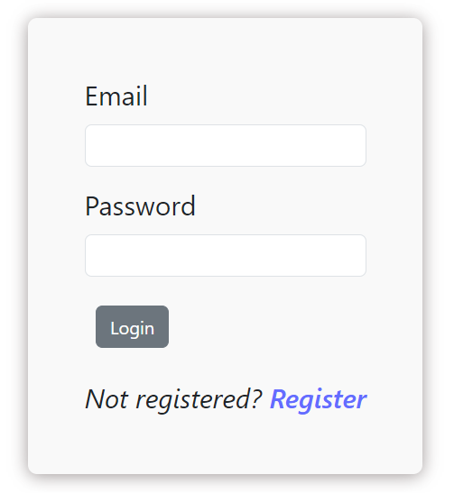 
**Register** 
 
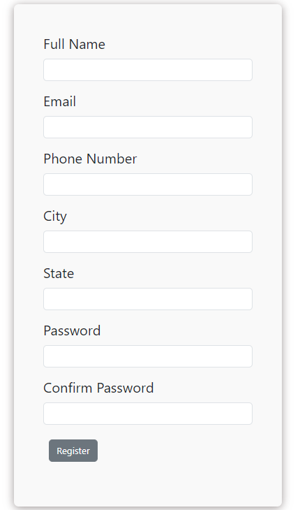

## Event Listings
Browse a comprehensive list of upcoming volunteering events in your area to find activities that resonate with your passions. 
 
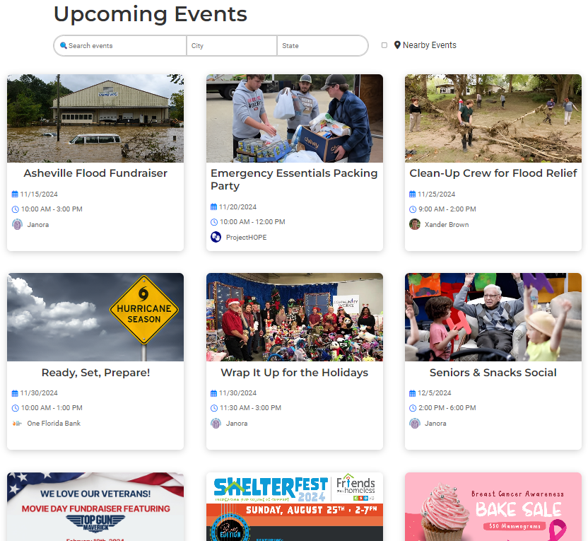

## Event Details
Click on an event for more details, including the location, date, time, and other details. 
 
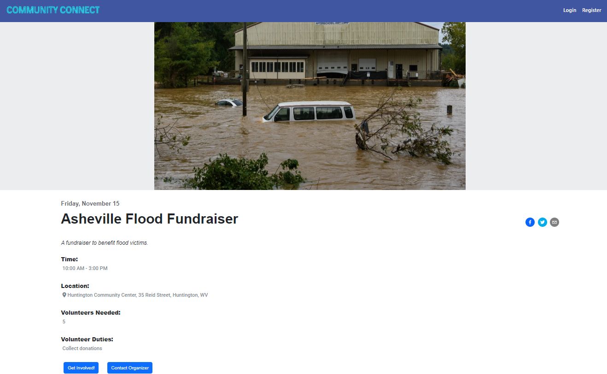

## Volunteer Form
Click on the "Get Involved" button on the event details page to sign up to volunteer. 
 
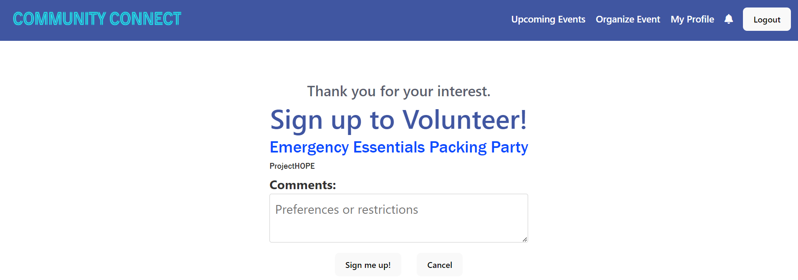

## Contact Organizer Form
Click on the "Contact Organizer" button on the event details page to submit an inquiry. 
 
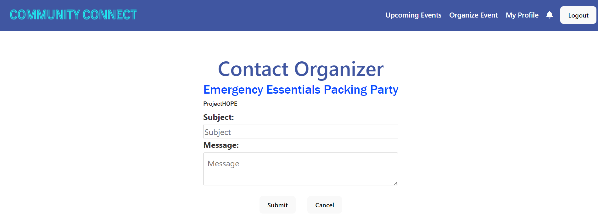

## Notifications 
A new notification is posted when you sign up to volunteer for an event or contact the organizer of an event.  
 
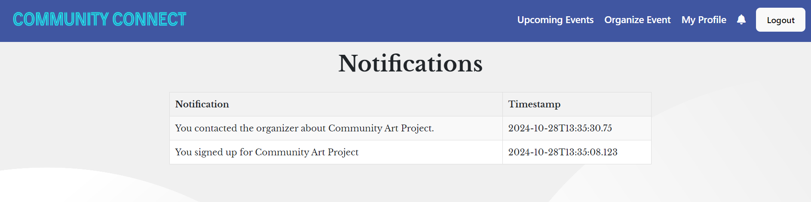

## Create an Event
Organize your own event. 
 
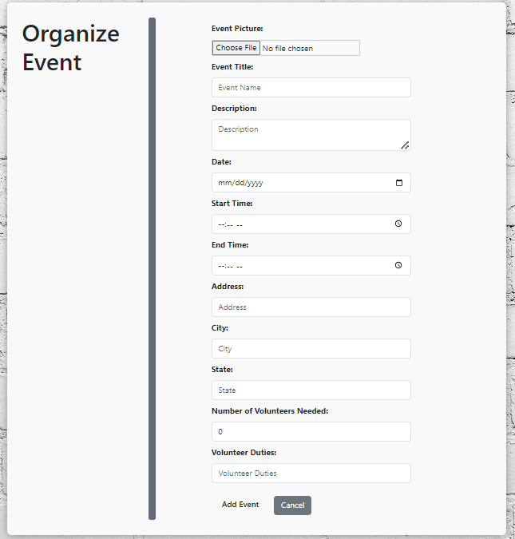

## Edit an Event
Edit your event. 
 
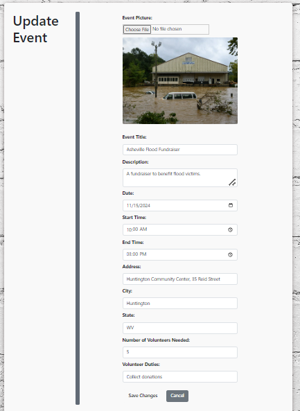

## My Profile and Events
View and update your profile. You can also view events you have organized, are volunteering in and past events.  
 
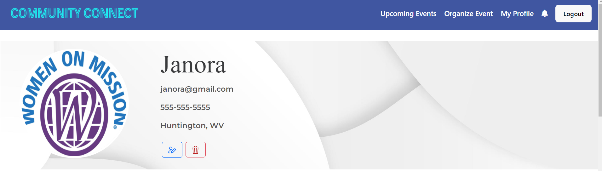
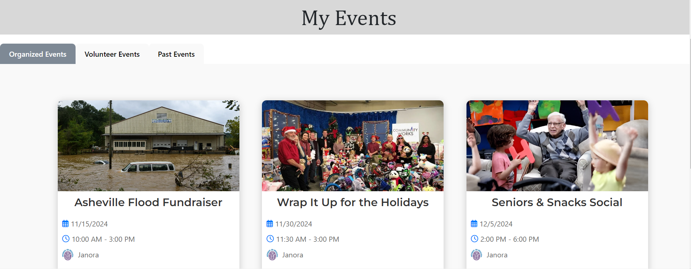

## Volunteer List
Click on "View Volunteers" button on the event details page for an event you organized to view the volunteer list. 
 
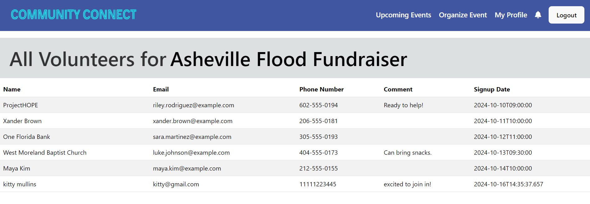

## Contact Organizer List
Click on "View Contact Forms" button on the event details page for an event you organized to view the list of inquiries you received for that event. 
 
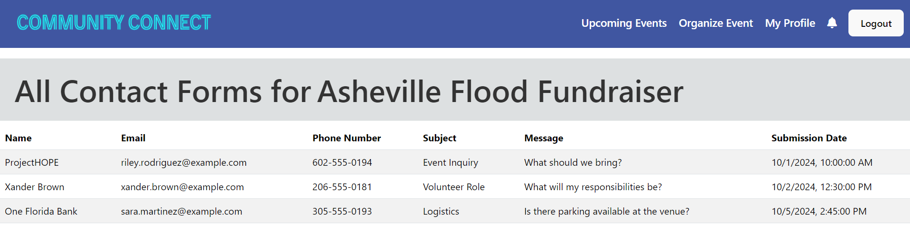

